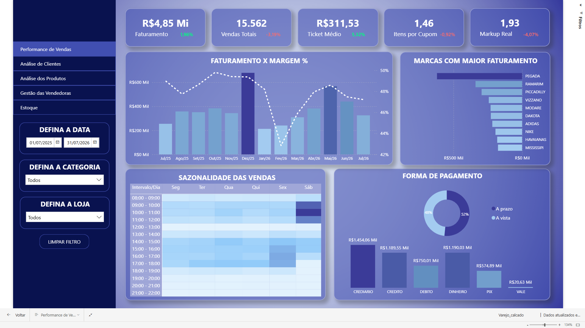
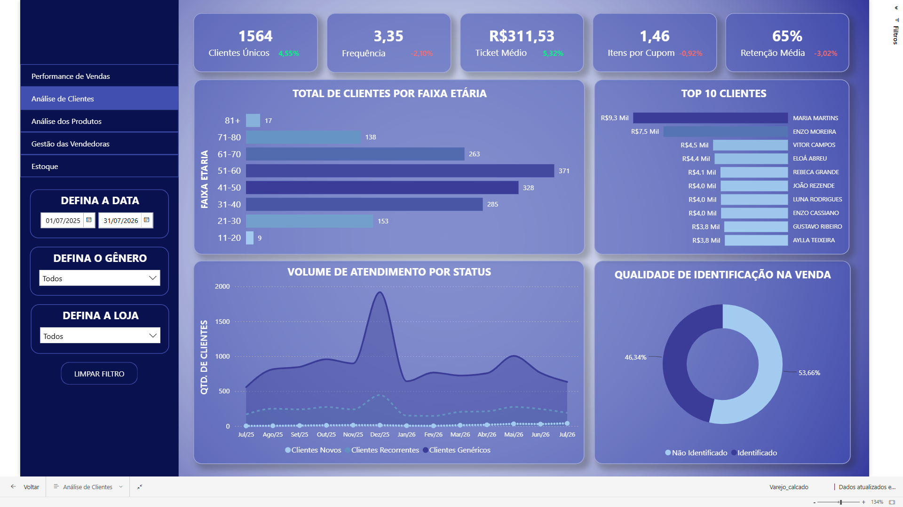
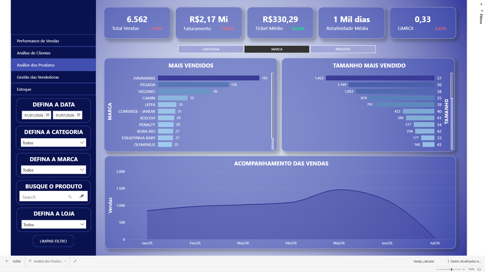
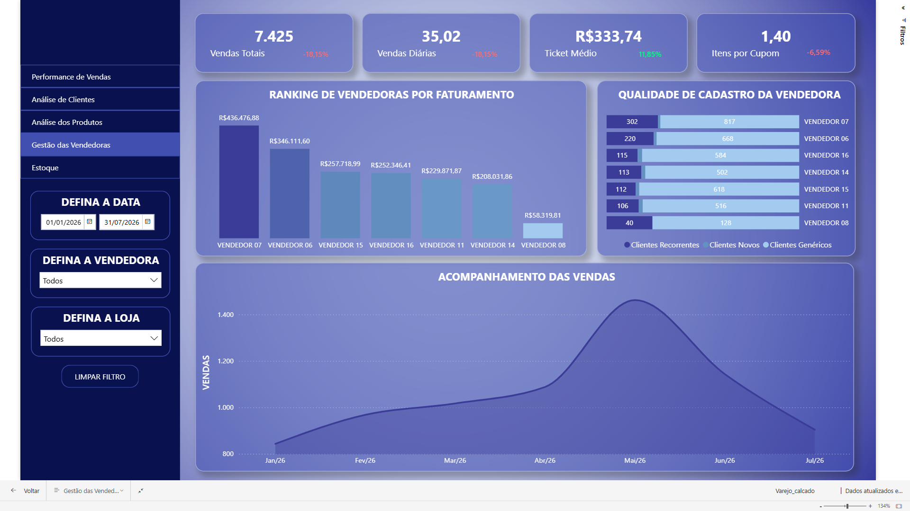
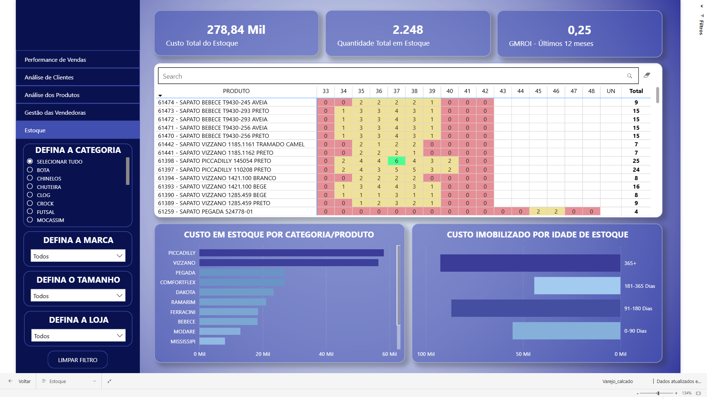
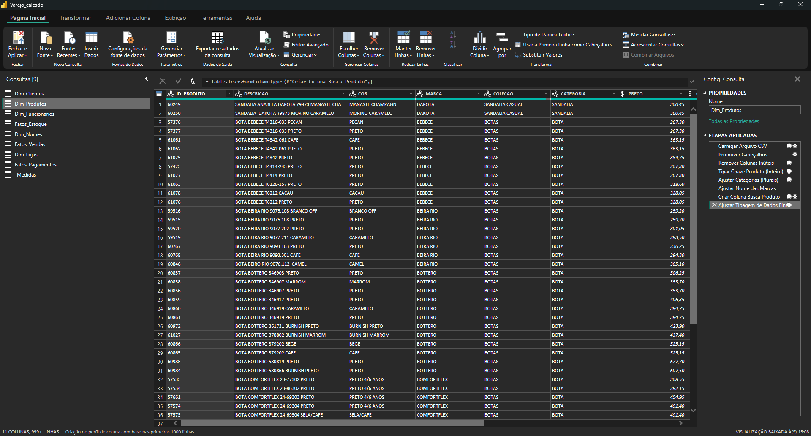
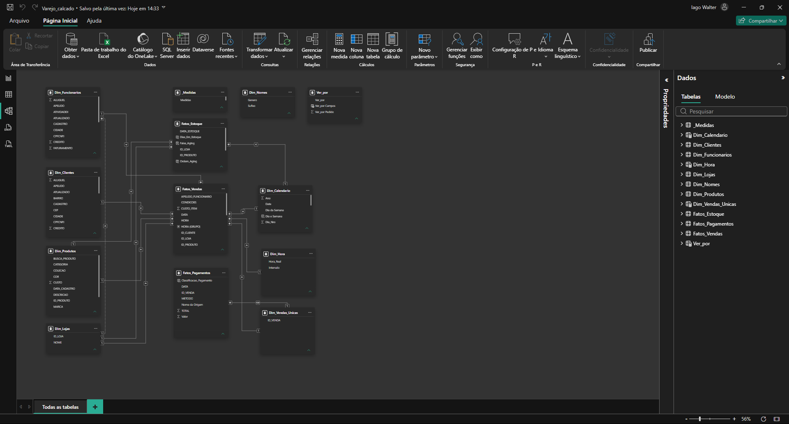
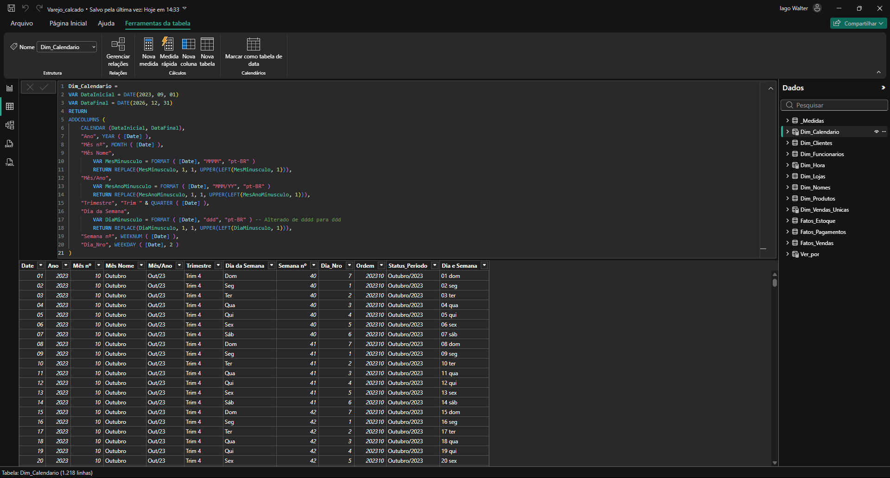

# Dashboard de Varejo – Análise de Performance e Estoque

Sistema de visualização de dados desenvolvido em Power BI para acompanhamento de métricas e otimização da tomada de decisão no varejo de calçados.

## 🔴 Acesso ao Dashboard
**[Clique aqui para acessar o projeto interativo na web](https://app.powerbi.com/view?r=eyJrIjoiZmJjZGE5YjktZDY3ZC00OTgxLTgyNzEtYWVkZWVrZjViMGNjIiwidCI6ImRmN2Q2NTBkLWMxNmMtNDVhOC1hYjZhLTQwNTNhOGRkNDk5MCJ9)**
*(Nota: Para fins de demonstração pública, os dados originais deste projeto foram anonimizados. Nomes de clientes e funcionários são totalmente fictícios e todos os valores financeiros foram multiplicados por um fator para modificar os montantes reais, preservando assim a privacidade dos clientes e o sigilo estratégico da empresa).*
---

## 🎯 Objetivo
Prover aos gerentes da lojas uma visão clara sobre o negócio, permitindo acompanhar o faturamento, entender o perfil do cliente e produtos mais vendidos através de dados atualizados.

## 📌 Sobre o Projeto
Este projeto de Business Intelligence foi desenvolvido para resolver o problema de consolidação de relatórios fragmentados gerados pelo sistema ERP da loja. A solução centraliza os dados de vendas, financeiro e estoque em um único modelo relacional.

O painel permite responder a perguntas de negócio como:
- Qual é o ticket médio e os horários de pico da loja?
- Qual é o perfil demográfico do nosso cliente (faixa etária)?
- Qual é a performance de faturamento de cada vendedor?
- Quanto temos de capital imobilizado no estoque antigo?

## ⚙️ Funcionalidades
- **Performance de Vendas:** Faturamento, Ticket Médio, Itens por Cupom e Sazonalidade (Heatmap de horários).
- **Análise de Clientes:** Top 10 Clientes, volume de atendimento por status e retenção.
- **Análise de Produtos:** Identificação dos produtos, categorias, marcas e tamanhos mais vendidos, além do acompanhamento histórico de saída de mercadorias.
- **Gestão de Vendedores:** Ranking de faturamento e análise da qualidade dos cadastros feitos pela equipe.
- **Estoque:** Custos em estoque, idade dos produtos parados e cálculo de GMROI.

---

## 📸 Telas do Projeto

### Performance de Vendas

### Análise de Clientes

### Análise de Produtos

### Gestão de Vendedoras

### Estoque

---

# 🏗️ Arquitetura da Solução

## 🔄 Fluxo de Dados
Devido a limitações do sistema ERP do cliente, que não suporta extração automatizada via banco de dados ou API, o fluxo de atualização foi desenhado utilizando pastas sincronizadas em nuvem. 
Os relatórios são exportados para um diretório no SharePoint/OneDrive, e o Power BI Service conecta-se diretamente a essa nuvem para ler e consolidar os dados.

## 🧩 Componentes

### ☁️ Armazenamento (SharePoint / OneDrive)
Repositório central onde os arquivos `.csv` gerados pelo ERP são depositados e sincronizados para a nuvem.

### ⚙️ Power Query (Linguagem M)
Responsável pela conexão com a pasta na nuvem, limpeza dos dados brutos, tratamento de tipagens e consolidação (empilhamento) das tabelas mensais de vendas e financeiro.

### 🧮 DAX (Data Analysis Expressions)
Utilizado para a construção de inteligência de tempo, cálculos de margem de lucro e criação de métricas de negócio, como o GMROI.

### 📊 Power BI
Ferramenta utilizada para a modelagem relacional (*Star Schema*) e desenvolvimento de toda a interface visual e navegação do relatório.

## 🔀 Fluxo Técnico
1. **Extração:** Exportação manual dos relatórios do ERP para o OneDrive/SharePoint.
2. **Transformação (ETL):** O Power Query conecta-se à nuvem, extrai os arquivos e realiza as devidas limpezas e formatações.

   *(Exemplo do tratamento de dados no Power Query)*
   

3. **Modelagem:** Criação do modelo relacional (*Star Schema*) dividindo as informações em tabelas Fato (Vendas, Pagamentos) e Dimensão (Clientes, Produtos, Vendedores, Calendário).

   *(Estrutura de Relacionamentos do Modelo)*
   

   *(Tabela Auxiliar de Calendário criada com DAX)*
   

4. **Visualização:** Aplicação de regras de negócio, desenvolvimento do layout e configuração de filtros visuais (ocultando dados residuais como registros sem cadastro) para garantir a consistência das análises.
5. **Automação:** Configuração de *Scheduled Refresh* (Atualização Agendada) no Power BI Service, garantindo que os diretores tenham os KPIs atualizados diariamente de forma automática, assim que novos arquivos CSVs são inseridos na nuvem.
